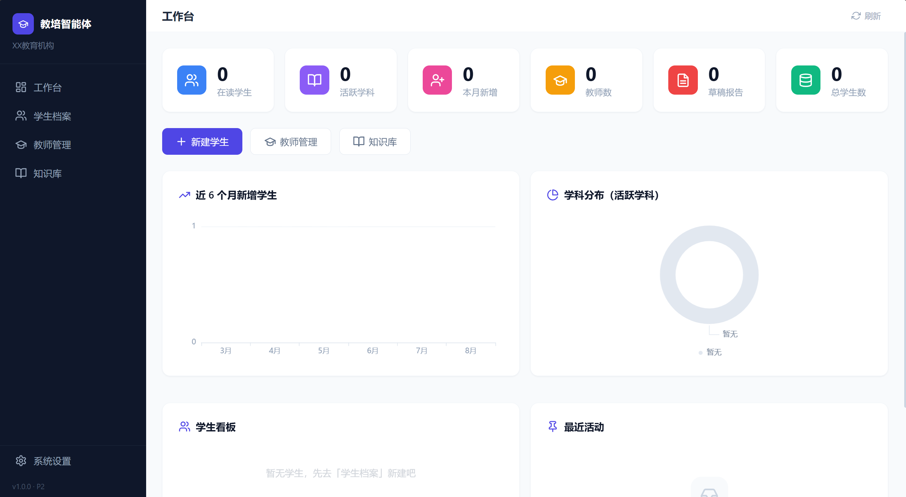

# 教培智能体 (EduAgentHub)

教培行业智能桌面工具 —— **AI 对话式采集 + 按学科管理**的一站式学员管理及 AI 助学系统。本地运行、数据不出电脑，单 exe 免部署即开即用。



```
建档 → 新建学科 → AI对话式采集 → 生成学情报告+课程规划 → 导出Word/PDF → 报名
教学 → 录入成绩 → 成绩曲线 → AI分析 → 课程规划调整 → 循环
知识 → 上传资料 → 自动切片入库(ChromaDB) → AI引用(RAG) + 智能问答
```

---

## ✨ 核心能力

| 模块 | 功能 |
|------|------|
| 工作台 | 统计看板（在读/学科/新增/教师/草稿报告）+ 新增趋势 + 学科分布 + 学生看板 + 最近活动 |
| 学生档案 | 学生 CRUD + 状态机（在读/结课/放弃）+ 多学科管理 + 停用/启用 |
| AI 对话采集 | 聊天式采集学情，AI 追问、自动判断信息是否足够、生成学情总结 |
| 学情报告 | 章式排版（10 章）+ 方法总纲/写在最后 + 内联编辑 + 分节重新生成 + AI 引用知识库 |
| 课程规划 | 规划表格编辑器 + 版本历史/回退 + AI 课程调整 + 统一指派教师 |
| 成绩追踪 | 单条/批量录入 + ECharts 成绩曲线（原始分/百分制/目标参考线）+ AI 成绩分析 |
| 沟通日志 | 与家长/学生的沟通留痕（电话/微信/面谈） |
| 教师管理 | 教师 CRUD + 擅长科目多选 |
| 知识库 | PDF/Word/TXT/MD 上传 → 自动切片 → 向量入库（ChromaDB）+ 检索测试 + 重建 |
| 智能问答 | 基于机构知识库的 AI 问答（RAG）+ 引用来源 + 历史 + AI 查询改写 + 自动分类 |
| 系统设置 | LLM/Embedding 多模型配置 + 机构信息（名称/Logo/默认课时）+ 数据备份 |

---

## 🚀 快速开始（开发模式）

```bash
pip install -r requirements.txt
venv\Scripts\activate        # Windows 激活虚拟环境
python main.py               # 浏览器自动打开 http://127.0.0.1:8888
```

> 首次使用：进入「系统设置 → AI 配置」，填好 LLM（及知识库用的 Embedding）Provider 即可开始。

## 📦 打包运行（单 exe）

```bash
venv/Scripts/python.exe -m pip install pyinstaller
venv/Scripts/python.exe -m PyInstaller build/build.spec --noconfirm
```

产物：`dist/TutoringAgent.exe`（约 69MB 单文件）。

- **双击即用**，无需安装 Python/依赖，前端资源已全部本地化、完全离线可用
- 首次运行在 exe 同级自动创建 `data/`（数据库/向量库/上传/导出），与开发环境隔离
- 重新打包：同上命令即可（注意先退出正在运行的 exe）

## 🔐 数据安全

- **自动备份**：每次启动自动备份数据库到 `data/backups/`，保留最近 14 份
- **手动备份**：设置页「数据管理 → 立即备份」，可查看备份列表
- 恢复：关闭程序 → 用备份文件替换 `data/tutoring.db` → 重启

## 🔌 AI 服务

- 适配器模式，支持 **OpenAI / DeepSeek / Claude / 通义千问 / 自定义(OpenAI 兼容)** 5 种 Provider
- LLM 与 Embedding 独立配置；切换 Embedding 模型后需在知识库页「重建」
- 知识库检索需配置支持向量化的 Provider（DeepSeek 不提供向量接口）

## 🗂️ 项目结构

```
├── main.py                  # 入口（启动 FastAPI + 自动开浏览器）
├── config.py                # 全局配置（路径/端口）
├── backend/
│   ├── app.py               # FastAPI 应用工厂
│   ├── routers/             # API 路由（每模块一文件）
│   ├── models/              # SQLAlchemy 模型（11 张表）
│   ├── services/            # 业务逻辑（报告生成/对话/知识库/成绩分析）
│   ├── ai/                  # AI 适配层（Provider×5 + Prompt 模板）
│   └── utils/               # 备份/文档导出/活动埋点等
├── frontend/                # 纯静态前端（Vue3 CDN + Tailwind 本地编译）
│   ├── index.html           # SPA 入口（版本自愈机制）
│   ├── pages/               # 9 个页面模板
│   ├── components/          # 侧边栏 + SVG 图标库
│   └── vendor/              # 本地化库（Vue/Router/ECharts/jsPDF 等）
├── docs/                     # 文档归档（1.0需求基线 + 1.0开发事项）
├── deploy/                   # 服务器部署（Dockerfile / nginx / 部署指南）
├── build/
│   ├── build.spec           # PyInstaller 打包配置
│   └── tailwind-input.css
└── data/                    # 运行时数据（不提交仓库）
    ├── tutoring.db          # SQLite 数据库
    ├── chroma_data/         # ChromaDB 向量库
    ├── backups/             # 数据库自动备份
    ├── uploads/             # 上传文档
    └── exports/             # 导出文件
```

## 🧰 技术栈

| 层级 | 技术 |
|------|------|
| 后端 | Python 3.11+ / FastAPI / SQLAlchemy 2.0 / SQLite |
| 向量库 | ChromaDB 0.5（嵌入式） |
| AI | 适配器模式（LLM + Embedding 均走 API，运行时可切换） |
| 文档解析 | python-docx / PyPDF2 / markdown |
| 前端 | Vue 3 / Vue Router 4 / ECharts 5 / Tailwind（本地编译）/ jsPDF+html2canvas |
| 打包 | PyInstaller 单 exe |

## 📚 文档

- **2.0 需求文档**：`需求文档与设计方案2.md`（班级管理 / 智能排课 / 全局总览 / 可迁移双轨）
- **1.0 需求文档**：`docs/需求文档与设计方案.md`（1.0 需求基线）
- **1.0 开发事项**：`docs/1.0开发事项.md`（P1~P9 完成记录 + 架构决策 + 开发纪律 + 遗留项）
- **2.0 开发交接**：`docs/2.0开发交接.md`（当前进度 P1~P4 + 关键技术 + 待办 P5/P6）
- **部署指南**：`deploy/deploy.md`（服务器双轨形态）

---

**v2.0（开发中）· P1 可迁移化已完成** | 本地运行 · 数据不出电脑 · 可迁移服务器
