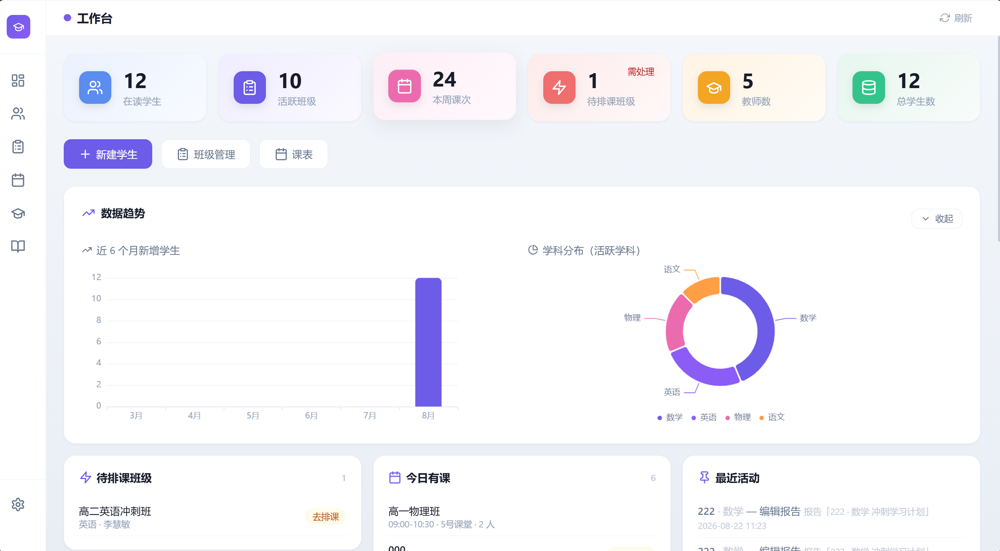

# 教培智能体 (EduAgentHub)

教培行业智能桌面工具 —— **AI 对话式采集 + 按学科管理**的一站式学员管理及 AI 助学系统。本地运行、数据不出电脑，单 exe 免部署即开即用，面向教培机构日常教务与教学管理。



```
建档 → 新建学科 → AI对话式采集 → 生成学情报告+课程规划（建议） → 导出Word/PDF → 报名
教学 → 录入成绩 → 成绩曲线 → AI分析 → 课程规划调整 → 循环
上课 → 班级管理（一对几）→ 智能排课 → 课表 → 临时调课 → 全局总览
知识 → 上传资料 → 自动切片入库(ChromaDB) → AI引用(RAG) + 智能问答
```

---

## ✨ 核心能力

### 教学管理
| 模块 | 功能 |
|------|------|
| 工作台 / 全局总览 | 统计看板（在读/学科/新增/教师/待排课/今日有课）+ 学生卡片流 + 待办区（待排课/今日有课/最近活动）+ 趋势/学科分布 |
| 学生档案 | 学生 CRUD + 状态机（在读/结课/放弃）+ 多学科管理；**新建学生自动引导新建学科 → 进入 AI 对话采集** |
| 学生总览 | 学科卡片（成绩火花线/报告徽章/规划进度）+ 班级区 + 全部学科 Tab 复用 |
| 成绩追踪 | 单条/批量录入 + ECharts 成绩曲线（原始分/百分制/目标参考线）+ AI 成绩分析 |
| 沟通日志 | 与家长/学生的沟通留痕（电话/微信/面谈） |
| 教师管理 | 教师 CRUD + 擅长科目多选 |

### 班级 / 排课 / 课表
| 模块 | 功能 |
|------|------|
| 班级管理 | 班型**一对几**（教务手动填人数，一对1~一对N，超员拦截）+ 学期跟班/寒暑假班 + 学生增减 + 快捷建班 |
| 智能排课 | 确定性约束算法（教师/教室/学生零冲突）+ 教室×时段网格 + Top-N 方案 + AI 点评 + 确认落库 |
| 课表 | 教室×时段网格（一屏显示）+ 日期切换 + 教师筛选 + **课程卡点击直达班级管理** |
| 临时调课 | **手动给指定日期加一节课**（一天可多节，计入总课时流程），带冲突检测，临时课琥珀色标注 |

### AI 助学
| 模块 | 功能 |
|------|------|
| AI 对话采集 | 聊天式采集学情，AI 追问、自动判断信息是否足够、生成学情总结 |
| 学情报告 | 章式排版（10 章）+ 方法总纲/写在最后 + 内联编辑 + 分节重新生成 + AI 引用知识库 + **课程规划标注为建议性计划** |
| 课程规划 | 规划表格编辑器 + 版本历史/回退 + AI 课程调整 + 统一指派教师（仅作建议，不创建真实课程） |
| 知识库 | PDF/Word/TXT/MD 上传 → 自动切片 → 向量入库（ChromaDB）+ 检索测试 + 重建 |
| 智能问答 | 基于机构知识库的 AI 问答（RAG）+ 引用来源 + 历史 + AI 查询改写 + 自动分类 |
| 系统设置 | LLM/Embedding 多模型配置 + 机构信息（名称/Logo/默认课时）+ 数据备份 |

---

## 🚀 快速开始（开发模式）

```bash
pip install -r requirements.txt
venv\Scripts\activate        # Windows 激活虚拟环境
python main.py               # 浏览器自动打开 http://127.0.0.1:8888
```

> 首次使用：进入「系统设置 → AI 配置」，填好 LLM（及知识库用的 Embedding）Provider 即可开始。

## 📦 打包运行（单 exe）

```bash
venv/Scripts/python.exe -m pip install pyinstaller
venv/Scripts/python.exe -m PyInstaller build/build.spec --noconfirm
```

产物：`dist/TutoringAgent2.0.exe`（约 72MB 单文件）。

- **双击即用**，无需安装 Python/依赖，前端资源已全部本地化、完全离线可用
- 首次运行在 exe 同级自动创建 `data/`（数据库/向量库/上传/导出），与开发环境隔离
- **升级**：只替换 exe、保留同级 `data/` 文件夹即可，数据自动保留
- 重新打包：同上命令即可（注意先退出正在运行的 exe）

## 🔐 数据安全

- **自动备份**：每次启动自动备份数据库到 `data/backups/`，保留最近 14 份
- **手动备份**：设置页「数据管理 → 立即备份」，可查看备份列表
- 恢复：关闭程序 → 用备份文件替换 `data/tutoring.db` → 重启
- 数据 100% 在本地，不依赖网络，隐私不外传

## 🔌 AI 服务

- 适配器模式，支持 **OpenAI / DeepSeek / Claude / 通义千问 / 自定义(OpenAI 兼容)** 5 种 Provider
- **推理模型兼容**：o4-mini/gpt-5 自动用 `max_completion_tokens`、deepseek-reasoner 自动省略 `temperature`；长报告自动放宽输出上限
- LLM 与 Embedding 独立配置；切换 Embedding 模型后需在知识库页「重建」
- 知识库检索需配置支持向量化的 Provider（DeepSeek 不提供向量接口）

## 🗂️ 项目结构

```
├── main.py                  # 入口（启动 FastAPI + 自动开浏览器）
├── config.py                # 全局配置（路径/端口，EDU_* 环境变量可覆盖）
├── backend/
│   ├── app.py               # FastAPI 应用工厂
│   ├── routers/             # API 路由（每模块一文件，含 2.0：教室/班级/排课/总览）
│   ├── models/              # SQLAlchemy 模型（16 张表）
│   ├── services/            # 业务逻辑（报告/对话/知识库/排课/寒暑假班）
│   ├── ai/                  # AI 适配层（Provider×5 + Prompt 模板）
│   ├── utils/               # 备份/文档导出/方言层/活动埋点
│   └── tests/               # 回归(63项) + 排课/冲突单测(15项)
├── frontend/                # 纯静态前端（Vue3 CDN + Tailwind 本地编译）
│   ├── index.html           # SPA 入口（版本自愈机制）
│   ├── pages/               # 11 个页面模板
│   ├── components/          # 侧边栏 + SVG 图标库
│   └── vendor/              # 本地化库（Vue/Router/ECharts/jsPDF 等）
├── docs/                     # 交接文档 + 需求基线 + 开发事项归档
├── deploy/                   # 服务器部署（Dockerfile / nginx / 部署指南）
├── build/
│   ├── build.spec           # PyInstaller 打包配置
│   └── tailwind-input.css
└── data/                    # 运行时数据（不提交仓库）
    ├── tutoring.db          # SQLite 数据库
    ├── chroma_data/         # ChromaDB 向量库
    ├── backups/             # 数据库自动备份
    ├── uploads/             # 上传文档
    └── exports/             # 导出文件
```

## 🧰 技术栈

| 层级 | 技术 |
|------|------|
| 后端 | Python 3.11+ / FastAPI / SQLAlchemy 2.0 / SQLite |
| 向量库 | ChromaDB 0.5（嵌入式） |
| AI | 适配器模式（LLM + Embedding 均走 API，运行时可切换，兼容推理模型） |
| 文档解析 | python-docx / PyPDF2 / markdown |
| 前端 | Vue 3 / Vue Router 4 / ECharts 5 / Tailwind（本地编译）/ jsPDF+html2canvas |
| 打包 | PyInstaller 单 exe（windowed 无黑窗） |

## 📚 文档

- **2.1 交接文档**：`2.1交接文档.md`（最新权威：审查修复 + 需求1~7 + 企业级方向讨论）
- **2.0 交接文档**：`docs/2.0开发交接.md`（班级/排课/课表/总览 全貌）
- **2.0 需求文档**：`需求文档与设计方案2.md`（班级管理 / 智能排课 / 全局总览 / 可迁移双轨）
- **1.0 需求文档**：`docs/需求文档与设计方案.md`
- **1.0 开发事项**：`docs/1.0开发事项.md`（P1~P9 + 架构决策 + 开发纪律）
- **部署指南**：`deploy/deploy.md`（服务器双轨形态）

---

**v2.1 · 全部完成** | 本地运行 · 数据不出电脑 · 可迁移服务器
